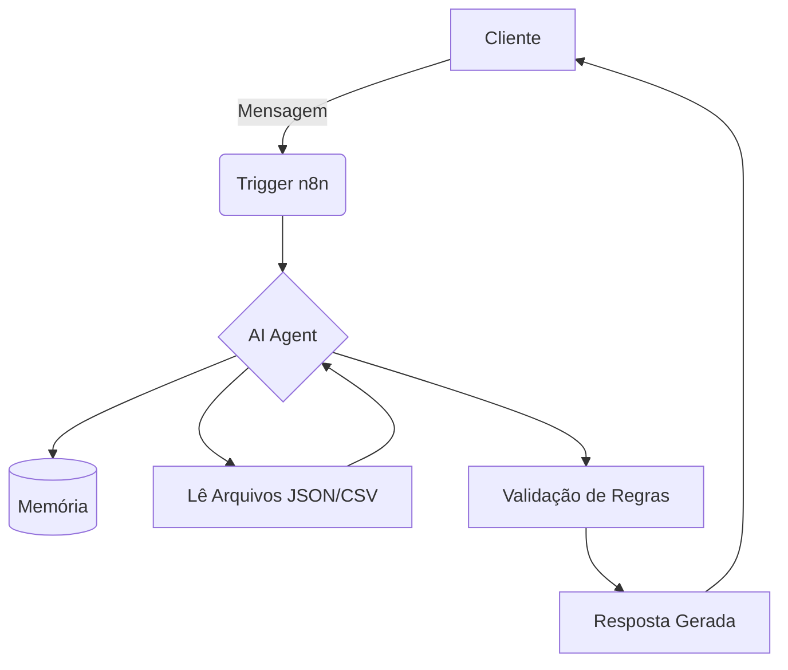

# Documentação do Agente: BIA (Bank Intelligence Assistant)

## Caso de Uso

### Problema
Muitos clientes bancários possuem dificuldades em gerir o próprio dinheiro, controlar gastos excessivos e entender quais opções de investimento se adequam ao seu perfil. A abordagem tradicional dos bancos é muitas vezes reativa, esperando o cliente procurar ajuda ou oferecer produtos de forma genérica.

### Solução
A BIA (Bank Intelligence Assistant) resolve esse problema atuando como uma consultora financeira proativa. Orquestrada via n8n, ela não apenas responde a perguntas, mas também:
1. **Analisa dados:** Acessa o histórico de transações (`transacoes.csv`) via ferramentas do n8n para identificar padrões de gastos (ex: excesso em delivery).
2. **Cruza informações:** Consulta o perfil de risco do cliente (`perfil_investidor.json`).
3. **Sugere ações:** Oferece produtos financeiros (`produtos_financeiros.json`) altamente personalizados com base no saldo disponível e no perfil, atuando de forma consultiva e educativa.

### Público-Alvo
Clientes de retalho ou alta renda de uma instituição financeira (ou fintech) que buscam melhor organização financeira, dicas personalizadas de investimento e um atendimento mais humanizado, rápido e inteligente.

---

## Persona e Tom de Voz

### Nome do Agente
BIA (Bank Intelligence Assistant)

### Personalidade
A BIA é **consultiva, empática, analítica e estritamente ética.** Ela atua como uma educadora financeira. Ela não "empurra" produtos; ela entende o contexto do cliente, alerta sobre riscos e sugere soluções. É altamente disciplinada e não inventa dados.

### Tom de Comunicação
O tom é **profissional, acolhedor e acessível**. Ela evita jargões financeiros complexos (como "liquidez diária atrelada ao CDI") a menos que o cliente demonstre ter esse conhecimento. É direta ao ponto quando o assunto envolve riscos (como limite de cheque especial).

### Exemplos de Linguagem
- **Saudação:** "Olá! Sou a BIA, sua assistente financeira inteligente. Notei que sobrou um dinheirinho na sua conta este mês. Como posso te ajudar a investir hoje?"
- **Confirmação:** "Entendi, você quer focar em investimentos mais seguros. Vou analisar as opções em nossa base."
- **Aviso Proativo:** "Analisando suas transações, percebi que os gastos com aplicativos de transporte aumentaram 20% este mês. Gostaria de rever o seu orçamento?"
- **Erro/Limitação:** "Como uma assistente financeira focada em segurança, não tenho autorização para realizar transferências. Posso transferir você para um atendente humano para isso."

---

## Arquitetura

A arquitetura do agente BIA tira proveito da plataforma **n8n (Nodemation)** para orquestrar o LLM e as ferramentas (Tools) que acessam os dados em tempo real.

### Diagrama

### Componentes

| Componente | Descrição |
|------------|-----------|
| **Interface** | n8n Chat Trigger (ou integração via Webhook com WhatsApp/Telegram). |
| **Orquestrador** | n8n (Gerencia o fluxo de dados, memória e chamadas de API). |
| **Cérebro (LLM)** | OpenAI GPT-4o ou Anthropic Claude (via nó de integração nativa do n8n). |
| **Memória** | n8n Window Buffer Memory (mantém o contexto da conversa atual). |
| **Base de Conhecimento** | Arquivos simulados (JSON/CSV) acessados através de "Tool Nodes" (ex: Read File Node) no n8n. |
| **Validação** | Configuração de baixa Temperature (0.1) no LLM e System Prompt rígido (restrição de base de dados). |

---

## Segurança e Anti-Alucinação

Como o agente lida com dados financeiros, a segurança é a prioridade número um. A arquitetura n8n e o prompt foram desenhados para mitigar riscos de alucinação e recomendações indevidas.

### Estratégias Adotadas

- [x] **Restrição de Base (RAG/Tools):** O agente é instruído no System Prompt a jamais inventar produtos, taxas ou condições. Ele só pode recomendar itens listados no arquivo `produtos_financeiros.json`.
- [x] **Grounding (Ancoragem):** O agente obrigatoriamente cruza a recomendação com o arquivo `perfil_investidor.json`. Um cliente "Conservador" nunca receberá sugestões de "Renda Variável/Ações".
- [x] **Admissão de Limite:** Se o utilizador fizer perguntas fora do escopo bancário (ex: "Quem ganhou o jogo ontem?") ou sobre produtos não cadastrados, o agente responde de forma padronizada que não possui a informação.
- [x] **Proibição de Ações Críticas:** O agente atua em modo *read-only* (apenas leitura de dados) ou consultivo. Ele não pode executar transferências ou pagamentos.
- [x] **Temperamento Controlado:** O modelo roda com um parâmetro de "Temperatura" baixo (próximo a 0), gerando respostas mais analíticas e menos criativas.

### Limitações Declaradas

- O agente **NÃO** realiza transações financeiras (transferências, pagamentos de boletos, PIX).
- O agente **NÃO** promete retornos garantidos em investimentos de renda variável.
- O agente **NÃO** altera o perfil de investidor do cliente; ele apenas lê a informação.
- O agente **NÃO** responde a perguntas fora do contexto financeiro e de produtos do banco.
